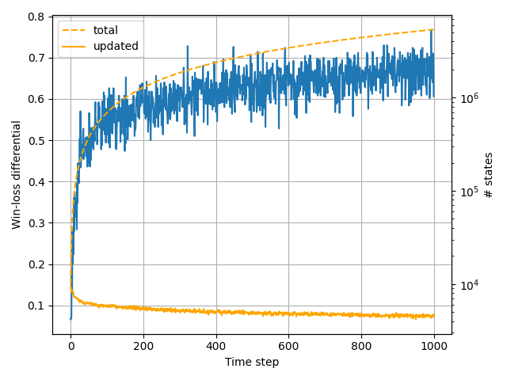

# Table of Contents
- [Introduction](#introduction)
- [Figures](#figures)
- [Content](#content)
  - [Mancala](#mancala)
- [Chapter 2](#chapter-2)
  - [`rl.environments.bandit.Arm`](#rlenvironmentsbanditarm)
  - [`rl.agents.q_value.EpsilonGreedy`](#rlagentsq_valueepsilongreedy)
  - [`rl.agents.q_value.QValue`](#rlagentsq_valueqvalue)
  - [`rl.environments.bandit.KArmedBandit`](#rlenvironmentsbanditkarmedbandit)
  - [`rl.utils.IncrementalSampleAverager`](#rlutilsincrementalsampleaverager)
  - [`rl.agents.q_value.UpperConfidenceBound`](#rlagentsq_valueupperconfidencebound)
  - [`rl.agents.h_value.PreferenceGradient`](#rlagentsh_valuepreferencegradient)
- [Chapter 3](#chapter-3)
  - [`rl.environments.mancala.MancalaState`](#rlenvironmentsmancalamancalastate)
  - [`rl.environments.mancala.Mancala`](#rlenvironmentsmancalamancala)
  - [`rl.environments.mdp.MdpEnvironment`](#rlenvironmentsmdpmdpenvironment)
  - [`rl.states.mdp.MdpState`](#rlstatesmdpmdpstate)
  - [`rl.states.mdp.ModelBasedMdpState`](#rlstatesmdpmodelbasedmdpstate)
  - [`rl.environments.mdp.Gridworld`](#rlenvironmentsmdpgridworld)
- [Chapter 4](#chapter-4)
  - [`rl.gpi.dynamic_programming.evaluation.evaluate_v_pi`](#rlgpidynamic_programmingevaluationevaluate_v_pi)
  - [`rl.gpi.dynamic_programming.evaluation.evaluate_q_pi`](#rlgpidynamic_programmingevaluationevaluate_q_pi)
  - [`rl.gpi.dynamic_programming.improvement.improve_policy_with_v_pi`](#rlgpidynamic_programmingimprovementimprove_policy_with_v_pi)
  - [`rl.gpi.improvement.improve_policy_with_q_pi`](#rlgpiimprovementimprove_policy_with_q_pi)
  - [`rl.gpi.dynamic_programming.iteration.iterate_policy_q_pi`](#rlgpidynamic_programmingiterationiterate_policy_q_pi)
  - [`rl.gpi.dynamic_programming.iteration.iterate_policy_v_pi`](#rlgpidynamic_programmingiterationiterate_policy_v_pi)
  - [`rl.gpi.dynamic_programming.iteration.iterate_value_v_pi`](#rlgpidynamic_programmingiterationiterate_value_v_pi)
  - [`rl.environments.mdp.GamblersProblem`](#rlenvironmentsmdpgamblersproblem)
  - [`rl.gpi.dynamic_programming.iteration.iterate_value_q_pi`](#rlgpidynamic_programmingiterationiterate_value_q_pi)
- [Chapter 5](#chapter-5)
  - [`rl.gpi.monte_carlo.evaluation.evaluate_v_pi`](#rlgpimonte_carloevaluationevaluate_v_pi)
  - [`rl.gpi.monte_carlo.evaluation.evaluate_q_pi`](#rlgpimonte_carloevaluationevaluate_q_pi)
  - [`rl.gpi.monte_carlo.iteration.iterate_value_q_pi`](#rlgpimonte_carloiterationiterate_value_q_pi)
<!--TOC-->

# Introduction
This is an implementation of concepts and algorithms described in "Reinforcement Learning: An Introduction" (Sutton
and Barto, 2018, 2nd edition). It is a work in progress that I started as a personal hobby, and its state reflects the 
extent to which I have progressed through the text. I have implemented it with the following objectives in mind.

1. **Complete conceptual and algorithmic coverage**:  Implement all concepts and algorithms described in the text, plus some.
1. **Minimal dependencies**:  All computation specific to the text is implemented here.
1. **Complete test coverage**:  All implementations are paired with unit tests.
1. **Clean object-oriented design**:  The text often provides concise pseudocode that is not difficult to write a one-off 
program for; however, it is an altogether different matter to architect a reusable and extensible codebase that achieves
the goals listed above in an object-oriented fashion.

As with all objectives, none of the above are fully realized. In particular, (1) is not met since I decided to make this 
repository public well before finishing. But the remaining objectives are fairly well satisfied.

# Figures
A list of figures can be found [here](src/rl/figures). Most of these are reproductions of those shown in the text; 
however, even the reproductions typically provide detail not shown in the text.

# Content
The following sections are generated programatically from annotation markers placed on functions and classes within the 
code. They give a rough sense of what is currently implemented, with respect to the text. Topics beyond those in the 
text are summarized below.

## Mancala
This is a simple game with many rule variations, and it provides a greater challenge in terms of implementation and 
state-space size than the gridworld. I have implemented a fairly common variation summarized below.

* One row of 6 pockets per player, each starting with 4 seeds.
* Landing in the store earns another turn.
* Landing in own empty pocket steals.
* Game terminates when a player's pockets are clear.
* Winner determined by store count.

A couple hours of Monte Carlo optimization explores more than 1 million states when playing against an equiprobable 
random opponent.



Key files are listed below.

* [Environment](src/rl/environments/mancala.py)
* [Test](test/rl/environments/mancala_test.py)

# Chapter 2
## `rl.environments.bandit.Arm`
```
Bandit arm.
```
## `rl.agents.q_value.EpsilonGreedy`
```
Nonassociative, epsilon-greedy agent.
```
## `rl.agents.q_value.QValue`
```
Nonassociative, q-value agent.
```
## `rl.environments.bandit.KArmedBandit`
```
K-armed bandit.
```
## `rl.utils.IncrementalSampleAverager`
```
An incremental, constant-time and -memory sample averager. Supports both decreasing (i.e., unweighted sample
    average) and constant (i.e., exponential recency-weighted average, pp. 32-33) step sizes.
```
## `rl.agents.q_value.UpperConfidenceBound`
```
Nonassociatve, upper-confidence-bound agent.
```
## `rl.agents.h_value.PreferenceGradient`
```
Preference-gradient agent.
```
# Chapter 3
## `rl.environments.mancala.MancalaState`
```
State of the mancala game. In charge of representing the entirety of the game state and advancing to the next state.
```
## `rl.environments.mancala.Mancala`
```
Environment for the mancala game.
```
## `rl.environments.mdp.MdpEnvironment`
```
MDP environment.
```
## `rl.states.mdp.MdpState`
```
Model-free MDP state.
```
## `rl.states.mdp.ModelBasedMdpState`
```
Model-based MDP state. Adds the specification of a probability distribution over next states and rewards.
```
## `rl.environments.mdp.Gridworld`
```
Gridworld MDP environment.
```
# Chapter 4
## `rl.gpi.dynamic_programming.evaluation.evaluate_v_pi`
```
Perform iterative policy evaluation of an agent's policy within an environment, returning state values.

    :param agent: MDP agent.
    :param theta: Minimum tolerated change in state value estimates, below which evaluation terminates. Either `theta`
    or `num_iterations` (or both) can be specified, but passing neither will raise an exception.
    :param num_iterations: Number of evaluation iterations to execute.  Either `theta` or `num_iterations` (or both)
    can be specified, but passing neither will raise an exception.
    :param update_in_place: Whether or not to update value estimates in place.
    :param initial_v_S: Initial guess at state-value, or None for no guess.
    :return: 2-tuple of (1) dictionary of MDP states and their estimated values under the agent's policy, and (2) final
    value of delta.
```
## `rl.gpi.dynamic_programming.evaluation.evaluate_q_pi`
```
Perform iterative policy evaluation of an agent's policy within an environment, returning state-action values.

    :param agent: MDP agent.
    :param theta: Minimum tolerated change in state value estimates, below which evaluation terminates. Either `theta`
    or `num_iterations` (or both) can be specified, but passing neither will raise an exception.
    :param num_iterations: Number of evaluation iterations to execute.  Either `theta` or `num_iterations` (or both)
    can be specified, but passing neither will raise an exception.
    :param update_in_place: Whether or not to update value estimates in place.
    :param initial_q_S_A: Initial guess at state-action value, or None for no guess.
    :return: 2-tuple of (1) dictionary of MDP states, actions, and their estimated values under the agent's policy, and
    (2) final value of delta.
```
## `rl.gpi.dynamic_programming.improvement.improve_policy_with_v_pi`
```
Improve an agent's policy according to its state-value estimates. This makes the policy greedy with respect to the
    state-value estimates. In cases where multiple such greedy actions exist for a state, each of the greedy actions
    will be assigned equal probability.

    Note that the present function resides within `rl.gpi.dynamic_programming.improvement` and requires state-value
    estimates of states that are model-based. These are the case because policy improvement from state values is only
    possible if we have a model of the environment. Compare with `rl.gpi.improvement.improve_policy_with_q_pi`, which
    accepts model-free states since state-action values are estimated directly.

    :param agent: Agent.
    :param v_pi: State-value estimates for the agent's policy.
    :return: Number of states in which the policy was updated.
```
## `rl.gpi.improvement.improve_policy_with_q_pi`
```
Improve an agent's policy according to its state-action value estimates. This makes the policy greedy with respect
    to the state-action value estimates. In cases where multiple such greedy actions exist for a state, each of the
    greedy actions will be assigned equal probability.

    :param agent: Agent.
    :param q_pi: State-action value estimates for the agent's policy.
    :param epsilon: Total probability mass to spread across all actions, resulting in an epsilon-greedy policy. Must
    be >= 0 if provided.
    :return: Number of states in which the policy was updated.
```
## `rl.gpi.dynamic_programming.iteration.iterate_policy_q_pi`
```
Run policy iteration on an agent using state-value estimates.

    :param agent: Agent.
    :param theta: See `evaluate_q_pi`.
    :param update_in_place: See `evaluate_q_pi`.
    :return: Final state-action value estimates.
```
## `rl.gpi.dynamic_programming.iteration.iterate_policy_v_pi`
```
Run policy iteration on an agent using state-value estimates.

    :param agent: Agent.
    :param theta: See `evaluate_v_pi`.
    :param update_in_place: See `evaluate_v_pi`.
    :return: Final state-value estimates.
```
## `rl.gpi.dynamic_programming.iteration.iterate_value_v_pi`
```
Run value iteration on an agent using state-value estimates.

    :param agent: Agent.
    :param theta: See `evaluate_v_pi`.
    :param evaluation_iterations_per_improvement: Number of policy evaluation iterations to execute for each iteration
    of improvement (e.g., passing 1 results in Equation 4.10).
    :param update_in_place: See `evaluate_v_pi`.
    :return: Final state-value estimates.
```
## `rl.environments.mdp.GamblersProblem`
```
Gambler's problem MDP environment.
```
## `rl.gpi.dynamic_programming.iteration.iterate_value_q_pi`
```
Run value iteration on an agent using state-action value estimates.

    :param agent: Agent.
    :param theta: See `evaluate_q_pi`.
    :param evaluation_iterations_per_improvement: Number of policy evaluation iterations to execute for each iteration
    of improvement.
    :param update_in_place: See `evaluate_q_pi`.
    :return: Final state-action value estimates.
```
# Chapter 5
## `rl.gpi.monte_carlo.evaluation.evaluate_v_pi`
```
Perform Monte Carlo evaluation of an agent's policy within an environment, returning state values. Uses a random
    action on the first time step to maintain exploration (exploring starts).

    :param agent:
    :param environment:
    :param num_episodes: Number of episodes to execute.
    :return: Dictionary of MDP states and their estimated values under the agent's policy.
```
## `rl.gpi.monte_carlo.evaluation.evaluate_q_pi`
```
Perform Monte Carlo evaluation of an agent's policy within an environment, returning state-action values.

    :param agent: Agent.
    :param environment: Environment.
    :param num_episodes: Number of episodes to execute.
    :param exploring_starts: Whether or not to use exploring starts, forcing a random action in the first time step.
    This maintains exploration in the first state; however, unless each state has some nonzero probability of being
    selected as the first state, there is no assurance that all state-action pairs will be sampled. If the initial state
    is deterministic, consider passing False here and shifting the burden of exploration to the improvement step with
    a nonzero epsilon (see `rl.gpi.improvement.improve_policy_with_q_pi`).
    :param initial_q_S_A: Initial guess at state-action value, or None for no guess.
    :return: 2-tuple of (1) dictionary of all MDP states and their action-value averagers under the agent's policy, (2)
    set of only those states that were evaluated, and (3) the per-episode average reward obtained.
```
## `rl.gpi.monte_carlo.iteration.iterate_value_q_pi`
```
Run value iteration on an agent using state-action value estimates.

    :param agent: Agent.
    :param environment: Environment.
    :param num_improvements: Number of policy improvements to make.
    :param num_episodes_per_improvement: Number of policy evaluation episodes to execute for each iteration of
    improvement. Passing `1` will result in the Monte Carlo ES (Exploring Starts) algorithm.
    :param epsilon: Total probability mass to spread across all actions, resulting in an epsilon-greedy policy. Must
    be >= 0 if provided.
    :param num_improvements_per_plot: Number of improvements to make before plotting the per-improvement average. Pass
    None to turn off all plotting.
    :param num_improvements_per_checkpoint: Number of improvements per checkpoint save.
    :param checkpoint_path: Checkpoint path. Must be provided if `num_improvements_per_checkpoint` is provided.
    :param initial_q_S_A: Initial state-action value estimates (primarily useful for restarting from a checkpoint).
    :return: State-action value estimates from final iteration of improvement.
```
