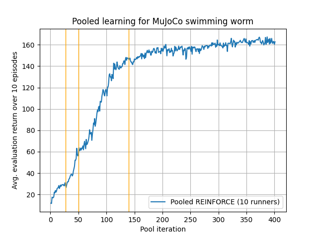

# MuJoCo Swimming Worm (Pooled Processes)
* Content
{:toc}

# Introduction
One hurdle in developing a control agent for the MuJoCo swimming worm was runtime (see [here](mujoco_swimming_worm.md)).
It took ~70,000 training episodes and ~3 days of runtime to train the agent. Several factors contribute to the 
runtime:  policy dimensionality, learnings rates, the speed of simulation via `gym` and `mujoco-py`, and the speed of 
JAX to calculate policy gradients. Instead of working to mitigate these issues, I was curious to explore the use of 
multiple CPU cores during training. My first version linked above ran on a single CPU core. The question is, how should 
multiple CPU cores be leveraged? I am certain that this question had been answered many times in many ways, but as usual 
with my RLAI work I wanted to find an answer without skipping ahead to known solutions.

# Concept
I tried several approaches that did not work.

1. I had each process/core work on its own subpool of agents, and periodically the processes would exchange their best
   known agents with each other. However, maintaining more agents than available CPU cores turned out to be a bad idea, 
   since any work on a suboptimal agent in a subpool was a distraction from improving the best agent in the subpool.
1. I then compounded the previous bad idea by introducing a low (epsilon) probability of a subpool process selecting -- 
   not the best agent from other pools -- but a random agent from across all subpools. This just slowed things down even
   further.
1. ...
1. ... (I tried several variations on the above ideas without success.)
1. ...

Two things gradually became clear:

1. Each process should attempt to improve the best known agent for a short amount of time. That is, the picture should 
   look as follows:
   
   In the above figure, the training pool always starts from the best known agent, improves the policies for a few 
   episodes, and then reselects the best known agent for the next training pool iteration. Each process in the pool is
   exploring independently by sampling the beta distributions that underlie its policy. Thus, a larger training pool 
   will provide more efficient exploration. This was a big improvement over my previous approaches. Learning was quicker
   and the policies were notably more effective. 
1. The policy selection at the end of each iteration seemed haphazard. I don't have quantitative evidence for this, but 
   it felt like policies were being selected on the basis of noise rather than a strong signal about their 
   effectiveness. A policy would be selected and then perform poorly in the next iteration of the training pool. It 
   occurred to me that two things were wrong. First, I was using the sum of rewards during the final training pool 
   episode to rank the policies for selection; however, because each policy is updated at the end of each training pool
   episode, the episode's rewards never corresponded exactly to the new policy. They were always out of step. I needed
   a performance metric with good correspondence to the policy, which immediately suggested running the policy in the
   environment without updating the policy. Because a single run would likely be noisy, I introduced an evaluation 
   phase in which the policies coming out of the training pool iteration would be run for several episodes to obtain a
   reliable performance metric for each. The final concept is shown below:
   

# Implementation

# Training

# Results

2.45 minutes per pool iteration for 400 iterations gives a total runtime of ~16 hours. This is a 78% reduction compared 
with the previous attempt's runtime of ~72 hours.

