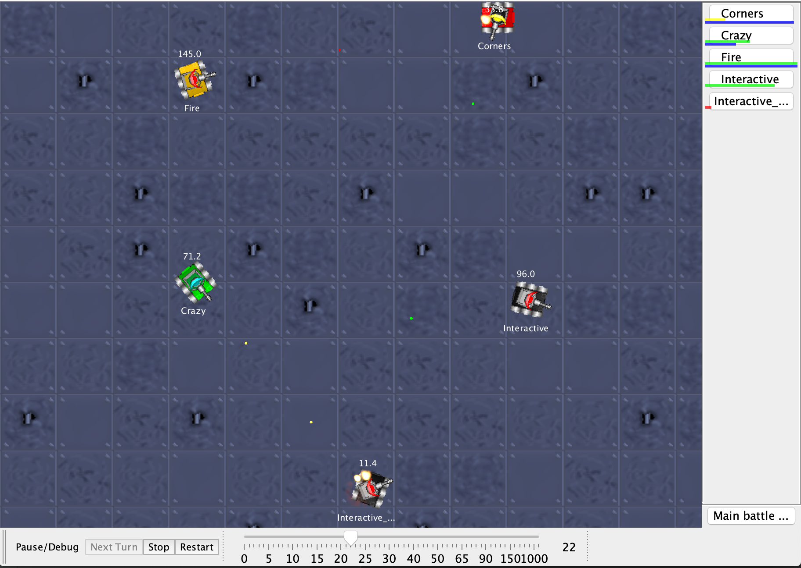

# Robocode
Robocode is a programming game in which robot agents are programmed to operate in a simulated battle environment. Full
documentation about the game can be found [here](https://robowiki.net/wiki/Main_Page). Robocode has several features
that make it an appealing testbed for reinforcement learning:

* Rich dynamics:  The state space is continuous, and each robot has several dimensions of interrelated action, some of
  which are discrete (fire or not) and some of which are continuous (rotation of the robot, gun, and radar). There are 
  many options for reward functions. The [official scoring function](https://robowiki.net/wiki/Robocode/Scoring) is a 
  mixture of many variables, and simpler reward functions can be designed (e.g., bullet hit percentage, robot energy 
  level lost or gained).
* Multi-agent with teaming:  Robocode is inherently multi-agent. Teams can be formed, and team members can communicate
  by passing messages to each other.
* Integration with `rlai`:  The architecture of Robocode lends itself to integration with `rlai` via local network-based 
  exchange of state and action information.
  
The purpose of this case study is to explore the use of `rlai` for learning robot policies.

# Installing Robocode

1. Download the Robocode installer 
   [here](https://github.com/MatthewGerber/robocode/raw/master/build/robocode-rlai-setup.jar). This is a customized 
   build of Robocode that has been modified to make it compatible with `rlai`. This build provides robots with elevated 
   permissions, particularly (1) permission to use TCP (socket) communication with the localhost (127.0.0.1) and (2)
   permission to perform reflection-based inspection of objects. These permissions are needed to communicate with the 
   `rlai` server, and in general they do not pose much of a security risk; however, it is probably a good idea to avoid 
   importing other robots into this installation of Robocode.
1. Run the Robocode installer. Install to a directory such as `robocode_rlai`.

# Running Robocode with `rlai`

1. Start the Robocode `rlai` environment. This is most easily done using the 
   [JupyterLab notebook](../jupyterlab_guide.md). There is already a configuration saved in the notebook that should 
   suffice as a demonstration of reinforcement learning with Robocode. Load the configuration and start it.
1. Start Robocode from the directory into which you installed it above. Add a few robots as well as the `RlaiRobot`, 
   then begin the battle. If this is successful, then you will see the `RlaiRobot` moving, firing, etc. This is the 
   start of training, so the agent will likely appear random until its policy develops.
1. In order to restart training with different parameters, you will need to first restart the Robocode application and 
   then restart the `rlai` environment by killing the command (if using the CLI) or by restarting the JupyterLab kernel. 
   This is a bit tedious but is required to reset the state of each.

# Development of a RL Robot for Robocode
The following sections explore the development of a RL robot for Robocode. The approach taken here is incremental and
focuses on developing particular skills, rather than addressing the entire behavior policy at once. Each section links
to a GitHub commit marking the code and configurations that were used.

## Radar-Driven Aiming Against a Stationary Opponent ([GitHub](https://github.com/MatthewGerber/rlai/tree/204da60f432ece551e12cdfa0435ff1dbf6fc6af))
This section develops radar-driven aiming against a stationary opponent. The RL robot is also stationary, but is allowed
to rotate both its radar (to obtain bearings on the opponent) and its gun (to orient the gun with respect to the
opponent's bearing).

### Reward Signal
The reward signal at each time step is defined as the sum of bullet power that has hit the opponent, minus the sum of
bullet power that has missed the opponent.

### State Features
The following state features are defined per action. A brief explanation is given for the expected learning outcome
(ELO) of each feature.

* Action 1:  Turn radar left
  * **Feature 1 - Opponent bearing exists (binary)** _ELO_:  Rotate radar left when `false` and do not rotate radar when 
    `true`.
    
* Action 2:  Turn gun left/right
  * **Feature 1 - Has bearing on opponent (binary)** _ELO_:  Keep gun stationary when `false` and rotate gun when `true`.
  * **Feature 2 - Gun is counterclockwise from opponent (binary)** _ELO_:  Rotate gun clockwise when `true` and counterclockwise when `false`.
    
* Action 3:  Fire
  * **Feature 1 - Has bearing on opponent (binary)** _ELO_:  Do not fire when `false` and consider firing when `true`.
  * **Feature 2 - Square root of degree deviation from gun to opponent (continuous)** _ELO_:  Only fire gun when sufficiently well aimed.

### Learning Model
Key model parameters are listed below:

* SARSA state-action value estimation (n-step=100)
* Discounted (gamma=0.99)
* Epsilon greedy (epsilon=0.2)
* Stochastic gradient descent (step size=0.001)
* Number of Robocode training rounds:  30

The full training command with all parameters is listed below:

```
rlai train --random-seed 12345 --agent rlai.agents.mdp.StochasticMdpAgent --gamma 0.99 --environment rlai.environments.robocode.RobocodeEnvironment --port 54321 --train-function rlai.gpi.temporal_difference.iteration.iterate_value_q_pi --mode SARSA --n-steps 100 --num-improvements 1000 --num-episodes-per-improvement 1 --num-updates-per-improvement 1 --make-final-policy-greedy True --num-improvements-per-plot 5 --save-agent-path ~/Desktop/robot_agent.pickle --q-S-A rlai.value_estimation.function_approximation.estimators.ApproximateStateActionValueEstimator --epsilon 0.2 --plot-model --plot-model-per-improvements 5 --function-approximation-model rlai.value_estimation.function_approximation.models.sklearn.SKLearnSGD --loss squared_loss --sgd-alpha 0.0 --learning-rate constant --eta0 0.001 --feature-extractor rlai.environments.robocode.RobocodeFeatureExtractor
```

Running this training command in the [JupyterLab notebook](../jupyterlab_guide.md) is shown below:



### Results
Running the policy generated above generates the following Robocode battle:



It is clear that the agent has developed a tactic of not firing while rotating the radar at the start of the round to 
obtain a bearing on the opponent. Once a bearing is obtained, the gun is rotated accordingly and firing begins when
aim is sufficiently accurate. All ELOs are satisfied.

## Radar-Driven Aiming Against a Mobile Opponent (TBD)

## Evasive Movement (TBD)
