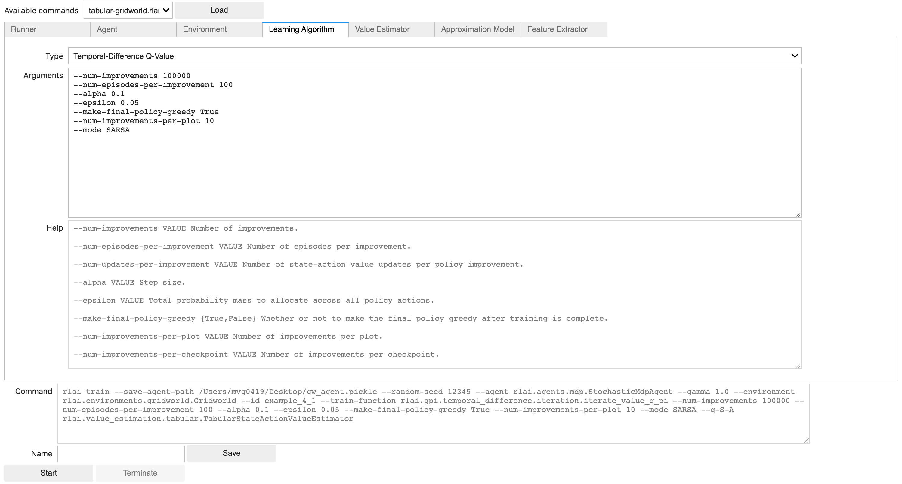

[Home](index.md) > JupyterLab RLAI
* Content
{:toc}
  
# Introduction
A companion JupyterLab notebook is provided to ease the use of RLAI. The goal of the interface is to assist with the 
composition, execution, and real-time inspection of RLAI commands. The primary composer interface is show below:

The notebook provides controls for starting, pausing, and resuming the execution of RLAI commands. All plots are
interactive and support zooming, panning, and axis rescaling. An example is shown below:

Certain state-active value function estimators (e.g., the scikit-learn stochastic gradient descent model) support 
diagnostic plots. An example is shown below:

For single-click access to the notebook, please click below:

Note that Binder notebooks are hosted for free by sponsors who donate computational infrastructure. Limitations are 
placed on each notebook, so don't expect the Binder interface to support heavy workloads.

# Local Installation
In addition to installing the core RLAI package, you will need to further 
install the `jupyter` extra. This can be done with pip via 
`pip install rlai[jupyter]`. Following installation, there are a few additional
steps required to get the notebook up and running.

1. Install `node`. On Mac, this can be done with [Homebrew](https://brew.sh/) via
   `brew install node`.
2. `jupyter labextension install @jupyter-widgets/jupyterlab-manager`
3. `jupyter labextension install jupyter-matplotlib`

Once the above are completed, run `jupyter lab` from your terminal.