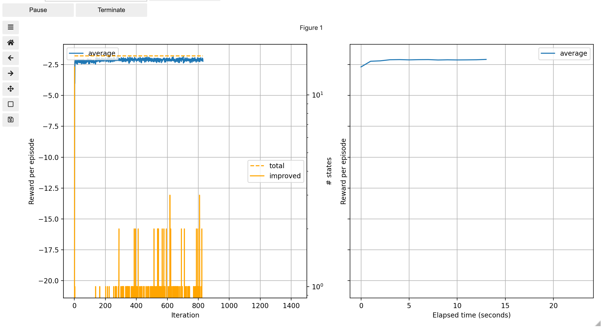

# Using `rlai` from the JupyterLab Interface

A companion JupyterLab notebook is provided to ease the use of `rlai`. The goal
of the interface is to assist with the creation of commands for subsequent 
processing.

## Installation
In addition to installing the core `rlai` package, you will need to further 
install the `jupyter` extra. This can be done with pip via 
`pip install rlai[jupyter]`. Following installation, there are a few additional
steps required to get the notebook up and running.

1. Install `node`. On Mac, this can be done with [Homebrew](https://brew.sh/) via
   `brew install node`.
1. `jupyter labextension install @jupyter-widgets/jupyterlab-manager`
1. `jupyter labextension install jupyter-matplotlib`

Once the above are completed, run `jupyter lab` from your terminal.