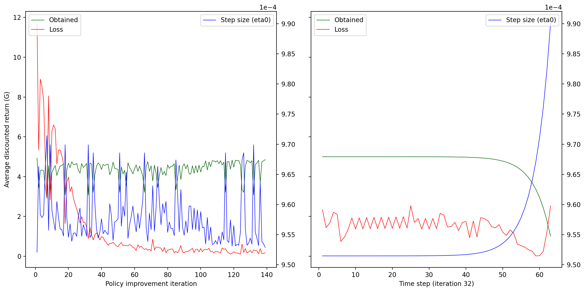

[Home](index.md) > Diagnostic and Interpretation Tools
* Content
{:toc}
  
# Introduction
Diagnostic and interpretation tools are standard issue for statistical models, though they would seem to be less 
developed and covered within RL. These tools are particularly important when value functions are approximated with 
models rather than calculated directly in tabular fashion.

# Gym Displays
RLAI instruments and displays many values in real time while rendering Gym environments. An example screenshot is 
shown below (see [continuous mountain car](./case_studies/mountain_car_continuous.md) for more information):


* Top left:  Environment state features and reward value.
* Top middle:  Environment rendering.
* Top right:  Action values.
* Bottom left:  State-value estimate, which is used as a baseline in the REINFORCE policy gradient algorithm.
* Bottom right:  Shape parameters `a` and `b` for the beta PDF.

# Model Coefficient Plots
Consider the gridworld of Example 4.1 solved with temporal-difference q-learning and stochastic gradient descent based 
on the four features extracted by 
`rlai.core.environments.gridworld.GridworldFeatureExtractor`. These features quantify the agent's distance from the top, 
bottom, left, and right of the gridworld's borders. This approach can be executed with the following command (see the 
[CLI Guide](cli_guide.md) for details):
```
rlai train --agent rlai.gpi.state_action_value.ActionValueMdpAgent --gamma 1 --environment rlai.core.environments.gridworld.Gridworld --id example_4_1 --train-function rlai.gpi.temporal_difference.iteration.iterate_value_q_pi --mode Q_LEARNING --n-steps 5 --num-improvements 10 --num-episodes-per-improvement 100 --epsilon 0.05 --q-S-A rlai.gpi.state_action_value.function_approximation.ApproximateStateActionValueEstimator --plot-model --num-time-bins 10 --function-approximation-model rlai.gpi.state_action_value.function_approximation.models.sklearn.SKLearnSGD --feature-extractor rlai.core.environments.gridworld.GridworldFeatureExtractor
```
The above command should generate plots such as the following:


As indicated by the title, this figure shows boxplots of model coefficients (y-values) over time (x-values) for each
feature (row) and action (column). The coefficients quantify the relationships among the feature-action pairs and the
episodic returns experienced by the agent. Variation within each boxplot results from binning the coefficient for a 
certain number of time steps. In this example, each bin spans 214 time steps of training (see the x-axes), and each
plot spans the same 10 bins of training, just from a different perspective on the model. To understand the details of 
the plots, consider the plot in the top-left corner, which shows the model-approximated value of the "up" action with 
respect to the "from-top" feature. The "from-top" feature measures the distance (in positive increments) from the top of 
the gridworld border to the agent. By the termination of training, the model shows a substantially negative coefficient 
(around -0.5) on "up" with respect to the "from-top" feature. In other words, the value of moving up decreases by 0.5 
for each unit of distance from the top border. This is the expected result given the location of the goal states in the 
top-left and bottom-right corners of the 4x4 gridworld. Symmetric explanations are to be found for "right", as well as 
for the other feature-action pairs shown. Note that the curvatures shown in the boxplots over time correspond to the 
iterative convergence of the stochastic gradient descent optimization. The curvature itself does not indicate the 
relationship of interest; rather, one should inspect the sign and magnitude of the final value.

# Model Instrumentation
The [JupyterLab interface](jupyterlab_guide.md) provides detailed instrumentation for certain models in real time, as
shown below. This information can be useful when diagnosing convergence and stability issues in state-action value
function approximation.



The left plot above shows per-iteration averages of return (green), model loss (red), and step size (blue). The right
plot shows the same variables for a single iteration, so that each time step is visible. The JupyterLab interface allows
interactive manipulation of these plots (e.g., zoom/pan) and selection of specific iterations to inspect in the right
plot. Plots like these assist with diagnosing problems in the learning parameterization, such as unstable returns and
nondecreasing losses.

